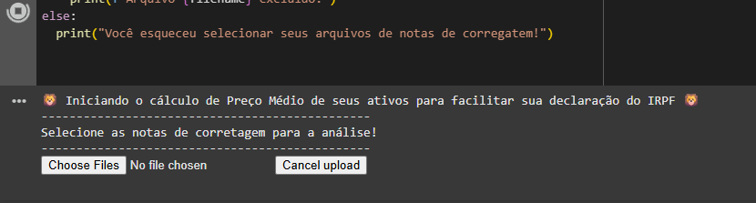
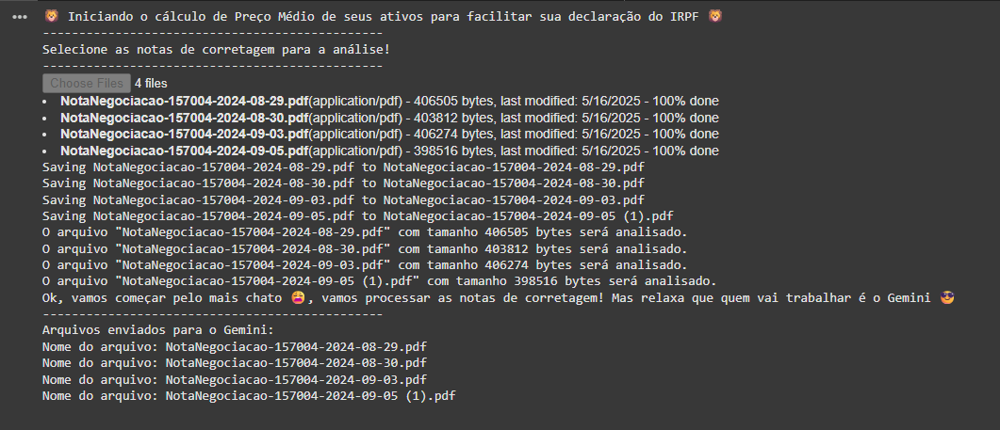
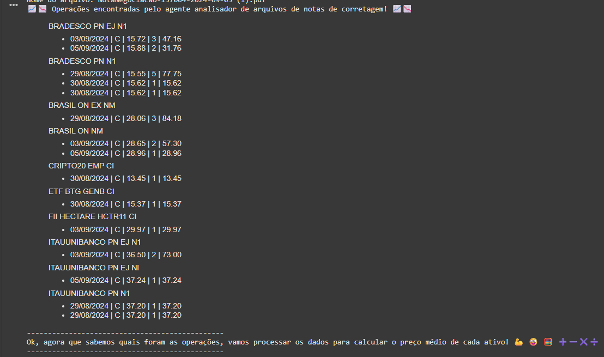
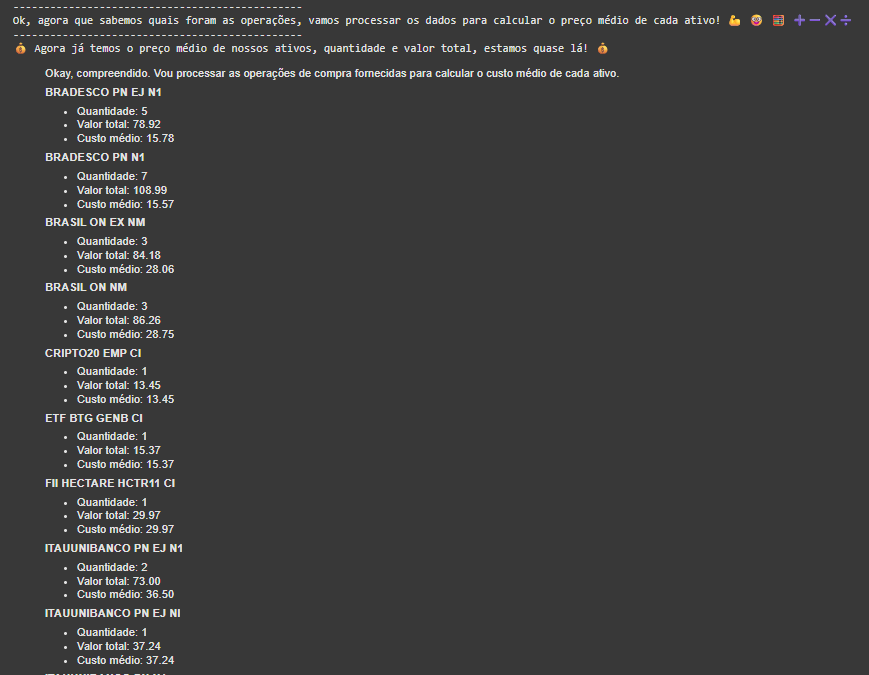
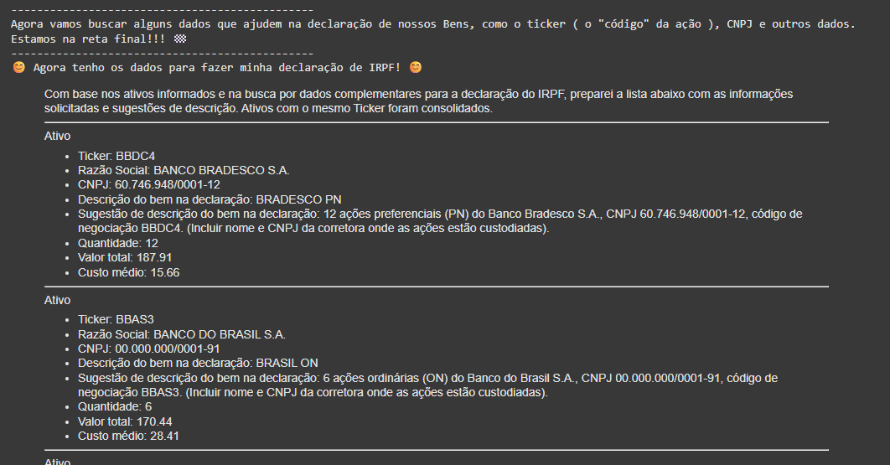

# ai_rpf_cm_ativos
Projeto da Imersão IA Alura + Google Gemini - Um agente que automatiza tarefas no cálculo de custo médio de ativos

# Calculadora de Custo Médio de Ativos para IRPF

## Descrição

Este projeto é uma ferramenta auxiliar desenvolvida para simplificar o cálculo do custo médio de ativos (ações, fundos, FIIs, ETFs, etc.) negociados na Bolsa de Valores Brasileira.  Ele automatiza o processo de extração de dados das notas de corretagem, eliminando a necessidade de cálculos manuais e reduzindo o tempo gasto na preparação da declaração do Imposto de Renda Pessoa Física (IRPF), através do uso de agentes criados com o SDK ( e ADK ) do Google Gemini.

**Com esta ferramenta, você pode:**

* **Importar Notas de Corretagem:** Selecione facilmente seus arquivos de notas de corretagem.
* **Extrair Dados Automaticamente:** A ferramenta analisa os documentos e extrai as informações relevantes (data da operação, ativo, tipo de operação (C/V), valor unitário, quantidade, valor total).
* **Calcular o Custo Médio:** O custo médio de cada ativo é calculado automaticamente, considerando todas as operações de compra e venda.
* **Obter Dados Complementares:** A ferramenta busca informações adicionais importantes para a declaração, como ticker do ativo, CNPJ da empresa/fundo e sugestão de descrição do bem.
* **Gerar um Relatório Organizado:** Os resultados são apresentados de forma clara e organizada, facilitando a transferência dos dados para sua declaração de IRPF.

## Como Usar

1.  **Pré-requisitos:**
    * Uma conta Google para acessar ao Google Colab.
    * Importar o projeto (Projeto_Imersão_IA_Alura_+_Google_Gemini.ipynb) para o Colab.
    * Você precisará obter uma API Key do Google Gemini e configurá-la como variável de ambiente (`GOOGLE_API_KEY`).
  
2.  **Como usar:**
    * Executar as células na sequência, sendo que na última célula haverá uma interface para selecionar as notas de corretagem em sua máquina.
    * 
    * Ao selecionar e confirmar a operação o processa iniciará o updload dos arquivos para o Colab e posteriormente para o Gemini
    * 
    * Após alguns instantes já exibirá o resultado do primeiro agente, que é responsável por processar os arquivos e obter os dados, em uma forma ainda mio "crua"
    * 
    * O resultado do primeiro agente será processado pelo segundo agente, responsável por processar os dados obtidos, com as regras de cálculo de custo/preço médio dos bens ( ativos negociados ).
    * 
    * O último agente recebe os dados do segundo agente e tem a tarefa de obter dados adicionais, como ticker, CNPJ, Razão social, além de gerar uma sugestão para descrição do bem, para ser usado na ficha de Bens e Diretiso.
    * 

3.  **Provaveis erros:**
    * Se apresentar erro que o arquivo não é válido porque não possui páginas, muito provavelmente é porque é um "pdf com senha", neste caso gere um pdf "sem senha". A forma mais simples é abrir o pdf usando a senha e usar a opção "Imprimir como PDF " ( ou equivalente em seu sistema operacional ) e o novo pdf que foi gerado não necessitará de senha, podendo ser processado corretamente.

## Contribuição

Contribuições são bem-vindas! Se você tiver ideias para melhorar o projeto, encontrou algum bug ou deseja adicionar novas funcionalidades, siga estas etapas:

1.  Faça um fork do repositório.
2.  Crie um branch para sua feature (`git checkout -b feature/minha-nova-feature`).
3.  Faça o commit das suas alterações (`git commit -am 'Adiciona nova feature'`).
4.  Faça o push para o branch (`git push origin feature/minha-nova-feature`).
5.  Crie um Pull Request.

Consulte o arquivo `CONTRIBUTING.md` para obter diretrizes mais detalhadas.

## Licença

Este projeto é licenciado sob a Licença MIT. Consulte o arquivo `LICENSE` para obter mais detalhes.

## Isenção de Responsabilidade

**IMPORTANTE:  Esta ferramenta é fornecida APENAS como um auxílio para facilitar o cálculo do custo médio de ativos. Ela NÃO substitui a necessidade de revisão e validação dos dados pelo usuário.**

* **Não nos responsabilizamos pelo uso incorreto da ferramenta.**
* **Todos os dados gerados devem ser cuidadosamente revisados pelo usuário.**
* **Esta ferramenta não substitui o aconselhamento ou os serviços de um profissional qualificado na área financeira ou contábil.**
* **Recomendamos fortemente que você consulte um profissional qualificado para auxiliar na sua declaração de imposto de renda, especialmente em casos complexos ou se você tiver dúvidas.**

**O uso desta ferramenta é de exclusiva responsabilidade do usuário.**
